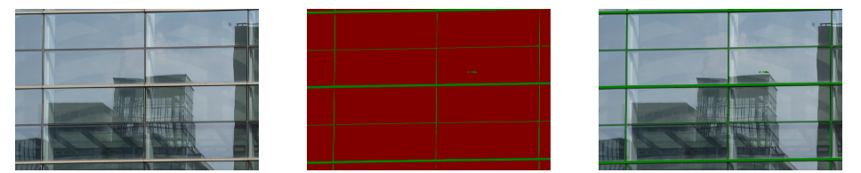
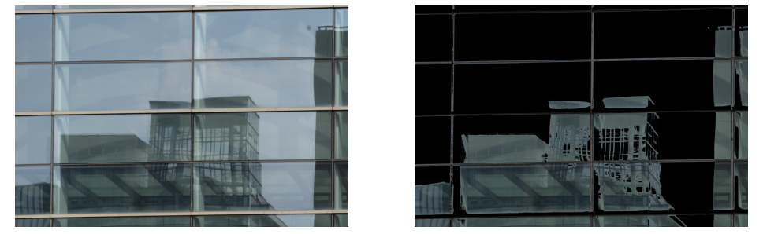
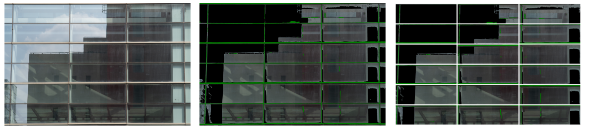

# Glass Curtain Wall Flatness Detection

## Introduction

This project focuses on automated flatness detection for glass curtain walls. Flatness is critical for both building aesthetics and structural safety, but current inspections rely on manual methods that are inefficient and risky.  

Our approach combines semantic segmentation and image processing: window frames are extracted, reflection regions are separated, and individual glass panels are divided with edge detection and Hough transform. Two methods are implemented to evaluate flatness — contour coordinate comparison and sampling-based chromaticity comparison — and their performance is analyzed to explore suitable application scenarios.

## Project Scope

This system targets facade inspection engineers and image analysis practitioners. It provides multiple flatness detection algorithms, supports easy image upload and result viewing, and visualizes analysis outcomes with report generation.  

Built with a **Pipe-Filter architecture**, the system consists of three core subsystems — user interaction, data processing, and detection algorithms — forming a streamlined pipeline: *Image Input → Processing → Result Output*.

## Methodology

### Window Frame and Reflection Extraction

#### 1. Dataset Collection and Annotation

High-resolution images of glass curtain walls were collected under different lighting conditions and at various times of the day. Manual annotation was performed using LabelMe to mark window frames and reflection regions.  

Since the dataset size was limited, two strategies were applied to improve model generalization:  

- **Data Augmentation**: rotation, scaling, brightness adjustment, and noise injection  
- **Transfer Learning**: reusing pretrained parameters (from an optic disc segmentation dataset in PaddlePaddle), while fine-tuning only the output layer

#### 2. Semantic Segmentation Model Training

We used a lightweight **U-Net** model from the PaddleSeg platform, trained on the annotated curtain wall dataset. Training focused on stable convergence by monitoring loss, learning rate, and training cost. After training, the model was evaluated on a validation set.  

**Overall performance:**

| Metric | mIoU   | Accuracy | Kappa  | Dice   |
| ------ | ------ | -------- | ------ | ------ |
| Score  | 0.8505 | 0.9884   | 0.8265 | 0.9132 |

**Class-level performance:**

| Class        | IoU    | Precision | Recall |
| ------------ | ------ | --------- | ------ |
| Background   | 0.9880 | 0.9931    | 0.9948 |
| Window Frame | 0.7131 | 0.8532    | 0.8128 |

These results show strong segmentation performance overall, with minor challenges in thin frame regions affected by reflections.

#### 3. Frame Extraction and Reflection Separation

Using the trained **segmentation model**, window frame regions were extracted from curtain wall images:  

  

After isolating the frame regions, **Otsu thresholding** was applied to automatically separate glass surface reflections from the background:  

  

### Single Glass Segmentation and Adjacency Construction

#### 1. Edge Detection and Region Division

**Canny edge detection** was applied horizontally and vertically to extract edges. **Hough Transform** was used to detect straight lines, filtering out noise and keeping lines representing panel boundaries. 

  

#### 2. Adjacency Relationship Modeling

After segmenting individual glass panels, adjacency relationships between rectangular units are established by checking horizontal and vertical neighbors based on their positions.

### Flatness Detection

#### Approach 1: Contour Coordinate Comparison

This geometry-based method evaluates flatness by comparing whether the reflection contours along adjacent glass panel boundaries are continuous and consistent.  

  

#### Approach 2: Sampling-based Chromaticity Comparison

This method evaluates flatness based on visual consistency. For each glass panel, inner edges are defined (offset = 30px) to avoid frame interference. Along these edges, 100 sampling points are selected, and their chromaticity values are computed in RGB space: 

$$Chroma = \sqrt{(R-G)^2 + (G-B)^2 + (B-R)^2}$$

Neighboring panels are compared by matching corresponding sampling points. If over 90% of pairs show consistent chromaticity classification, the adjacent panels are considered flat; otherwise, potential unevenness is indicated.  

  

## Results and Evaluation

Both methods demonstrate effectiveness under different conditions, each with unique strengths and limitations.  

| Dimension          | Contour Coordinate Comparison             | Sampling-based Chromaticity Comparison               |
| ------------------ | ----------------------------------------- | ---------------------------------------------------- |
| Basis              | Reflection contour coordinates            | Edge chromaticity features                           |
| Focus              | Geometric continuity & alignment          | Visual color consistency                             |
| Image Requirement  | Clear, unbroken contours                  | Relatively uniform color distribution                |
| Robustness         | Sensitive to noise/blur, weaker           | Stronger under lighting changes & occlusion          |
| Suitable Scenarios | Stable lighting, clear edges              | Variable lighting, blurred contours but stable color |
| Complexity         | Medium: contour extraction & mapping      | Higher: edge sampling & chroma calculation           |
| Limitation         | Accuracy drops with broken/occluded edges | Color differences may mislead detection              |

## Features

- Automated dataset preprocessing  
- Semantic segmentation for reflection detection  
- Two complementary methods for flatness assessment  

## Future Work

Future improvements may include:  

- Extending from edge-based to full-surface evaluation  
- Defining standardized flatness metrics  
- Combining image analysis with 3D measurement techniques  
- Adding human-in-the-loop feedback for higher reliability 

